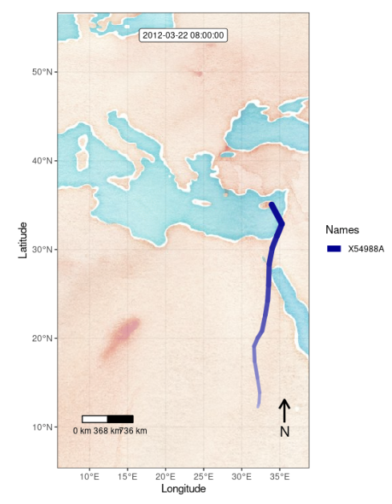
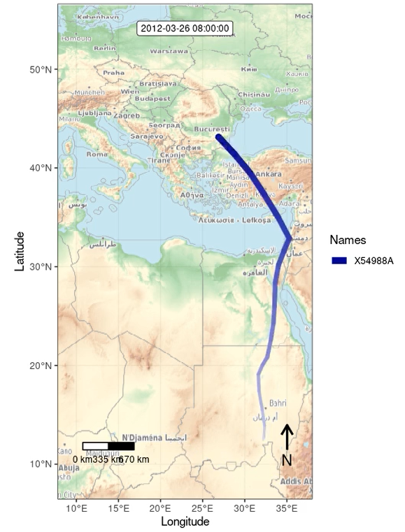
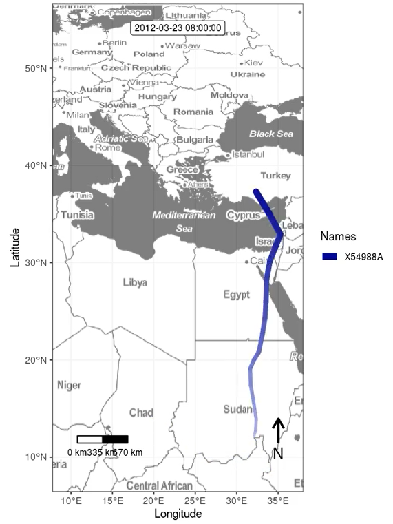
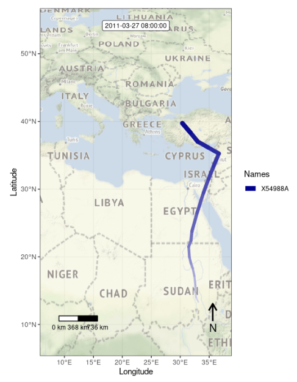
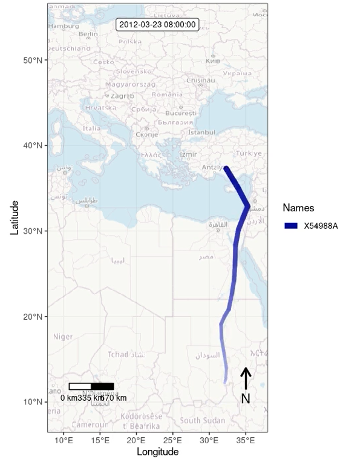

# Animated Map (moveVis)
MoveApps

Github repository: *github.com/movestore/animation-moveVis*

## Description
Generate an animation of your tracks using the moveVis R package. The animation is saved as an artefact that can be downloaded to your device. (Note: depending on the size of your data set this App may take a while to run (30+ min, see logs).) 

## Documentation
To generate an aligned animation of all tracks of the input data set, first all individual tracks are aligned by time and subsampled to a defined resolution (see settings below). Then all tracks are plotted as moving dots on a common 'osm' Map (beware that too frequent calls might lead to empty background, update to local OSM mirror is planned). The frames of all individual tracks are finally combined and written as an animated gif file to download as MoveApps output artefact. The original data set is also passed on as output to a possible next App. 

There are several options how to colour your tracks in the animation. Note that regardless of the colouring attribute, in the legend the track IDs are shown, however with the correct colour. This should be improved.

### Input data
move2 location object

### Output data
move2 location object

### Artefacts
`animation.moveVis.***`: Animated file showing an animation of all tracked positions aligned by time.

### Settings 
**Temporal resolution for alignment (`res`):** This parameter allows the user to define the time interval by which the tracks shall be thinned to align. One numeric value has to be entered. If no value is entered, this parameter defaults to the mean resolution of the data set. See unit below. 

**Unit of your alignment resolution (`uni`):** Parameter to select a time unit for alignment resolution. Can only be 'seconds' up to 'days'. Default is 'hours'.

**Speed of animation (`frames_per_sec`):** Number of frames to be shown per second to alter the speed of the animation. Default is 25.

**Map type (`maptype`):** Selection of map type for the animation background. The map will be downloaded from 'carto' (because Open Street Map does presently give errors). Default 'light'. Since the App can take a long time to run, see examples below of the available map types to help you make your decision (note that these examples were created using OSM maps).

**Resolution of background map (`mapres`):** Resolution of the background map. Can take values between 0 and 1. Default is 1. Note that, depending on the extent of your data set, too high or too low values here can lead to different errors. Please try out different values here.
 
**Track colour option (`col_opt`):** Options by which attributes to colour the tracks in the animation. Default is `one`, i.e. all tracks have the same colour (red). 
 
**Other attribute for track colouring (`other`):** Animal or track attribute name if the user has selected `other` in the above setting. Will not be used else. 
 
**Track ID legend (`show_legend`):** Should a legend containing the track IDs be shown? Default yes.
 
**Caption (`capt`):** Text for a caption that will be added at the bottom of the animation window. Default empty.
 
**Output file format (`file_format`):** Any of the following video formats: 'mp4', 'gif', 'mov', 'flv', 'avi', 'mpeg', '3gp', 'ogg'. Compatibility depends on computer system. Default is 'mp4'.
 
**Adaption factor for map extent (`ext_adapt`):** Adaption factor (multiplicative) for map extent. By default, the extent of the data is used. Default is 1.

#### Watercolor
Please note that the example maps have been made with osm maps.

#### Topographic

#### Toner

#### Terrain

#### Streets

### Most common errors
Background maps are not optimal, will be updated.

### Null or error handling:
**Temporal resolution for alignment (`res`):** If nothing (NULL) is entered here, a fallback default is used, namely the mean resolution of the data set. Note that only numeric values can be entered, else will lead to an error.

**Unit of your alignment resolution (`uni`):** This unit parameter defaults to 'hours', which might not fit to your data set or requirements; then you have to select a different unit.

**Map type (`maptype`):** Since there is a dropdown list of possible values, no errors are expected.

**Data:** The full input data set is returned for further use in a next App and cannot be empty.
